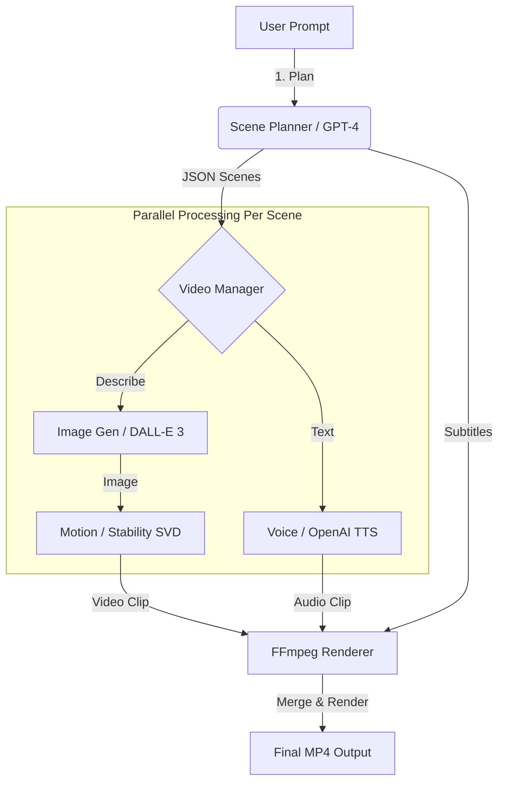

# Laravel AI Video – High-Performance Multi-Model Video Engine

[](https://packagist.org/packages/subhashladumor1/laravel-ai-video)
[](https://packagist.org/packages/subhashladumor1/laravel-ai-video)
[](https://packagist.org/packages/subhashladumor1/laravel-ai-video)

**Laravel AI Video** is a comprehensive, production-ready package for generating cinematic AI videos. It acts as an orchestration layer, combining the best AI models for scripting, visuals, motion, and voice into a single, unified pipeline.

Whether you need to automate **Social Media Reels**, create **Product Ads**, or generate **Storytelling Content**, this package handles the complex workflow of chaining AI APIs and rendering the final output.

---

## 🌟 Features

*   **🎬 Multi-Model Orchestration ("Composed" Driver)**:
    *   **Scripting**: OpenAI GPT-4o breaks prompts into cinematic scenes.
    *   **Visuals**: OpenAI DALL-E 3 generates high-consistency scene images.
    *   **Motion**: Stability AI (SVD) or Runway brings images to life.
    *   **Voice**: OpenAI TTS-1 adds synchronized voiceovers.
    *   **Rendering**: FFmpeg merges everything with transitions and subtitles.
*   **🖼️ Image-to-Video**: Direct support for animating static images (e.g., product photos).
*   **📱 Smart Templates**: Built-in aspect ratios for **Instagram/TikTok (9:16)**, **YouTube (16:9)**, and **Feeds (1:1)**.
*   **🛡️ AI Guard Integration**: Prevents API bill shock by estimating costs *before* execution and strictly enforcing budgets.
*   **⚡ High-Performance Architecture**:
    *   Queue-based asynchronous processing.
    *   Streams temporary files to avoid memory overflows.
    *   Parallel execution where possible (dependent on driver).

---

## 🛠️ How It Works

The **Composed Driver** automates the entire video production lifecycle:



---

## 🚀 Installation

1.  **Install via Composer:**
    ```bash
    composer require subhashladumor1/laravel-ai-video
    ```

2.  **Publish Configuration:**
    ```bash
    php artisan vendor:publish --tag=ai-video-config
    ```

3.  **Install FFmpeg:**
    Ensure `ffmpeg` and `ffprobe` are installed on your server.
    ```bash
    # Ubuntu/Debian
    sudo apt update && sudo apt install ffmpeg
    ```

4.  **Configure `.env`:**
    Add your API keys. The package works best with multiple providers enabled.
    ```env
    OPENAI_API_KEY=sk-...
    STABILITY_API_KEY=sk-...
    RUNWAY_API_KEY=...       # Optional
    
    # Enable the Budget Guard
    AI_VIDEO_GUARD_ENABLED=true
    ```

---

## � Complete Usage Guide

### 1. Text-to-Video (The "Composed" Pipeline)
This is the most powerful feature. It creates a full video from a simple text prompt.

**Basic Usage:**
```php
use Subhashladumor1\LaravelAiVideo\Facades\AiVideo;

$path = AiVideo::driver('composed')->textToVideo(
    "A cyberpunk detective walking through neon-lit rainy streets of Tokyo.",
    [
        'duration' => 15, // Total video duration (approx)
        'template' => 'youtube-short' // 9:16 Aspect Ratio
    ]
);

return response()->download($path);
```

**Advanced Usage (Asynchronous Job):**
Recommended for production to avoid timeout issues.

```php
use Subhashladumor1\LaravelAiVideo\Jobs\ProcessVideoJob;

ProcessVideoJob::dispatch(
    'text-to-video',
    "Create a 30-second commercial for a new eco-friendly coffee brand.",
    [
        'template' => 'instagram-reel', 
        'voice_id' => 'alloy',
        'style' => 'Cinematic, Warm Lighting, Slow Motion',
        'fps' => 30
    ],
    'composed'
);
```

### 2. Image-to-Video (Motion Generation)
Ideal for bringing product photography or static assets to life.

```php
use Subhashladumor1\LaravelAiVideo\Facades\AiVideo;

$videoPath = AiVideo::driver('stability')->imageToVideo(
    public_path('images/product-shoe.jpg'),
    [
        'motion_bucket_id' => 127, // 1-255: Controls amount of motion
        'duration' => 5 // Duration of the clip
    ]
);
```

### 3. Scene Planning (Scripting Only)
Use the AI Director to break down a script into visual scenes without generating the video yet. Useful for UI previews.

```php
$scenes = AiVideo::driver('openai')->generateScenes(
    "A history of the Roman Empire in 60 seconds."
);

// Returns:
// [
//    [
//      'scene_number' => 1,
//      'visual_description' => 'Aerial view of the Colosseum at sunset...',
//      'voiceover_text' => 'It began as a small city-state...',
//      'duration_seconds' => 5
//    ],
//    ...
// ]
```

### 4. Voiceover Generation (TTS)
Generate high-quality AI voiceovers directly.

```php
$audioPath = AiVideo::driver('openai')->generateVoice(
    "Welcome to the future of video generation.",
    'nova', // Voice options: alloy, echo, fable, onyx, nova, shimmer
    ['model' => 'tts-1-hd']
);
```

---

## 🛡️ AI Guard & Cost Control

This package includes a **Budget Enforcement System**. It estimates the cost of every operation *before* it runs.

**How to Configure:**
In `config/ai-video.php`:

```php
'guard' => [
    'enabled' => true,
    'cost_limit_per_video' => 5.00, // Maximum USD per video
],
```

**Usage Flow:**
```php
try {
    // This will throw an Exception if estimated cost > $5.00
    AiVideo::driver('composed')->textToVideo("An extremely long 1-hour movie description...");
} catch (\Exception $e) {
    // "Estimated cost $12.50 exceeds budget limit of $5.00"
    return back()->with('error', $e->getMessage());
}
```

---

## 📖 Function Reference

### `VideoDriver` Interface

The Facade `AiVideo::driver('name')` returns an instance implementing these methods:

| Method | Description | Options |
| :--- | :--- | :--- |
| `textToVideo($prompt, $opts)` | Generates full video from text. | `duration`, `template`, `style` |
| `imageToVideo($path, $opts)` | Animates a static image. | `motion_bucket_id`, `seed` |
| `generateScenes($script)` | Returns array of scene objects. | `model` (e.g., gpt-4o) |
| `generateVoice($text, $voice)` | Creates MP3 audio from text. | `output_path`, `speed` |
| `estimateCost($type, $params)` | Returns float ($) cost estimate. | `input` |

### Supported Templates

Templates control the Output Resolution and default styling.

| Template | Aspect Ratio | Resolution | Best For |
| :--- | :--- | :--- | :--- |
| `youtube-standard` | 16:9 | 1920x1080 | YouTube, TV, Desktop |
| `youtube-short` | 9:16 | 1080x1920 | Shorts, TikTok, Reels |
| `instagram-reel` | 9:16 | 1080x1920 | Instagram Stories/Reels |
| `square-post` | 1:1 | 1080x1080 | FB/Insta Feed, Product Ads |
| `portrait` | 4:5 | 1080x1350 | Mobile Feed |

---

## 🏗️ Extending

You can create your own drivers by implementing `Subhashladumor1\LaravelAiVideo\Contracts\VideoDriver`.

```php
namespace App\Drivers;

use Subhashladumor1\LaravelAiVideo\Contracts\VideoDriver;

class MyCustomDriver implements VideoDriver
{
    public function textToVideo(string $prompt, array $options = []): string
    {
        // Call your custom AI API here
        return 'path/to/video.mp4';
    }
    
    // implement other methods...
}
```

Register it in `AppServiceProvider`:
```php
AiVideo::extend('custom', function ($app) {
    return new MyCustomDriver();
});
```

---

## 🧪 Testing

```bash
composer test
```

## 📄 License

The MIT License (MIT). Please see [License File](LICENSE) for more information.
